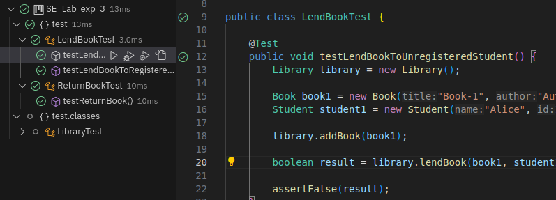

# آزمایشگاه مهندسی نرم‌افزار - آزمایش سوم - روش توسعه آزمون‌رانه و پوشش آزمون
اعضای گروه:
امیرحسین حاجی محمد رضایی - ۹۹۱۰۹۲۵۲
علی رازقندی - ۹۹۱۰۹۲۹۶
سید‌رضا قمقام - ۹۹۱۷۰۵۴۲

[لینک مستندات آزمایش سوم](https://github.com/ssc-public/Software-Engineering-Lab/blob/main/courseworks/experiments/TDD-and-coverage.md)

## گزارش بخش اول آزمایش
ابتدا با خواندن کد کلاس Library متوجه دو ایراد برنامه میشویم 
۱. هنگامی که یک نفر کتابی را پس میدهد این کتاب از لیسیت کتاب های در اختیار او حذف نمیشود.
۲. هنگامی که میخواهیم کتابی را به کسی قرض بدهیم باید چک کنیم که این فرد در کتابخانه ثبت نام کرده باشد که این کار را نمیکنیم.

حال برای تست این دو نکته دو فایل تست LendBookTest و ReturnBookTest را مینویسیم و اجرا میکنیم.

 

حال برای رفع این دو مشکل کد را بدین گونه تغییر میدهیم.

حال دوباره تست ها را ران میکنیم.

حال مشاهده میکنیم که هر دو تست کامل پاس شده اند.

## گزارش بخش دوم آزمایش - توسعه توابع جستجو با روش TDD 

در ابتدا با باز کردن پروژه در IntelliJ، بعد از مطالعه کد و زدن گزینه generate بر روی اسم کلاس Library یک فایل تست در پوشه مدنظر برای آن ایجاد می‌کنم:

که فایل ابتدایی ایجاد‌شده به صورت زیر خواهد بود:

حال ابتدا برای توسعه تابع جستجو دانشج.یان، در ابتدا تست‌های آن را می‌نویسم، این تست‌ها شامل ایجاد کتابخانه به ازای هرتست (متود setup)، تست جستجو دانشجویانی که در کتابخانه ثبت‌نام شده یا نشده‌اند و جستجو بر‌اساس نویسنده و عنوان (که خروجی در این حالت ندارد) می‌باشد و در این حالت کلا ۴ تست داریم که به صورت زیر هستند:

بعد از این مرحله، نتیجه تست‌ها را در حالتی که هنوز ویژگی موردنظر پیاده‌سازی نشده است، را بررسی می‌کنیم. همانطور که مشاهده می‌کنید در انی حالت تنها تست مذربوط به جستجو با اسم نویسنده و عنوان کتاب پاس می‌شود به خاطر اینکه در کد اولیه این متود‌ها null برمی‌گردانند.

حال در قدم بعدی ویژگی که در اینجا جستجو دانجویان ثبت‌نام شده در کتابخانه است را ایجاد می‌کنم:

حال بعد از پیاده‌سازی این ویژگی، نتیجه تست‌های مربوط به آن به صورت زیر خواهد بود:

در مرحله بعدی برای refactoring کد ایجاد‌شده، دیگر نیازی به تغییر دادن آن نیست زیرا کد به صورت بهینه پیاده شده است. حال در مرحله بعدی همین قدم‌ها را برای تابع جستجو کتاب‌های کتابخانه طی می‌کنم:
ایجاد تست‌ها:

نتیجه تست‌ها قبل از پیاده‌سازی ویژگی:

پیاده‌سازی ویژگی:

نتیجه تست‌ها بعد از پیاده‌سازی ویژگی:

## پاسخ پرسش‌ها:
۱. روش
TDD
را با روش تست کردن سنتی که در آن بعد از نوشتن برنامه، تست‌ها نوشته می‌شوند، از نظر نوع پروژه‌هایی که هر یک برای آن‌ها مناسب هست، مقایسه کنید.

پاسخ: روش تست سنتی را میتوان بیشتر برای پروژه‌هایی مناسب دانست که نیازمندی‌ها و ویژگی‌های برنامه ثابت هستند و دچار تغییرات زیادی در آینده نخواهند شد. در این صورت، هنگامی که در ابتدا نیازمندی‌ها آن برنامه ایجاد می‌شوند، در مرحله بعدی توسعه‌دهندگان می‌توانند تمام تمرکز خود را بر روی ایجاد تست‌هایی بی‌نقض قرار دهند تا این تست‌ها بتوانند به صورت دقیق، نیازمندی‌های پیاده‌سازی شده را از تمام جوانب بررسی کنند و صحت پیاده‌سازی نیازمندی‌ها را تایید کنند. اما روش TDD بیشتر برای توسعه‌های چابک مناسب‌تر است. پروژه‌هایی که در این روش توسعه وجود دارند، دارای ویژگی‌هایی هستند که مدام در حال تغییر هستند و همیشه این نیاز وجود دارد که نیازمندی‌های جدیدی به برنامه اضافه شود. برای اینکه در این شرایط توسعه‌دهندگان بتوانند یک دید به نسبت خوب نسبت به نیازمندی مورد‌ درخواست برای پیاده‌سازی داشته باشند، نوشتن تست قبل از پیاده‌سازی ویژگی و ایجاد ویژگی بعد از آن که این تست‌ها را پاس کند می‌تواند به توسعه‌دهندگان این اطمینان را دهد که ویژگی به صورت صحیح پیاده‌سازی شده است. در نتیجه، در روش توسعه چابک افراد دیگر دچار سردرگمی برای ایجاد ویژگی‌ها نخواهند شد.

۲. در فرایند ایجاد نرم‌افزار هم تیم ایجاد (Development Team) و هم تیم تضمین کیفیت (QA Team) وظیفه تست نرم‌افزار را برعهده دارند. هر کدام از این تیم‌ها بیش‌تر با کدام دسته از انواع تست سروکار دارد؟ چرا؟ انواع تست ذکر شده را به طور مختصر شرح دهید.

### تیم توسعه (Development Team)
تیم توسعه بیشتر با تست‌هایی سروکار دارد که به صورت اتوماتیک انجام می‌شوند و در مراحل اولیه توسعه نرم‌افزار قرار دارند. این تست‌ها شامل موارد زیر هستند:

1. **تست واحد (Unit Testing)**:
   - **شرح**: این تست‌ها به صورت مجزا بر روی هر واحد یا بخش کوچکی از کد انجام می‌شوند تا اطمینان حاصل شود که هر قسمت به درستی کار می‌کند.
   - **دلیل**: برنامه‌نویسان این تست‌ها را برای اطمینان از صحت کد خود و جلوگیری از ایجاد اشکالات در مراحل اولیه توسعه انجام می‌دهند.

2. **تست یکپارچگی (Integration Testing)**:
   - **شرح**: این تست‌ها برای اطمینان از کارکرد صحیح ماژول‌ها و واحدهای مختلف نرم‌افزار در کنار هم انجام می‌شوند.
   - **دلیل**: تیم توسعه می‌خواهد مطمئن شود که ترکیب اجزای مختلف نرم‌افزار بدون مشکل انجام می‌شود و ارتباطات بین آن‌ها به درستی کار می‌کند.

3. **تست رگرسیون (Regression Testing)**:
   - **شرح**: این تست‌ها پس از اعمال تغییرات یا اصلاحات در کد انجام می‌شوند تا اطمینان حاصل شود که تغییرات جدید باعث بروز اشکالات جدید نشده‌اند.
   - **دلیل**: توسعه‌دهندگان نیاز دارند تا مطمئن شوند که تغییرات جدید کد به کدهای قبلی آسیب نمی‌زند.

### تیم تضمین کیفیت (QA Team)
تیم تضمین کیفیت بیشتر با تست‌هایی سروکار دارد که به بررسی نرم‌افزار از دیدگاه کاربر و اطمینان از کیفیت کلی محصول تمرکز دارد. این تست‌ها شامل موارد زیر هستند:

1. **تست کارکردی (Functional Testing)**:
   - **شرح**: این تست‌ها بررسی می‌کنند که نرم‌افزار به درستی بر اساس نیازمندی‌ها و مشخصات کار کند.
   - **دلیل**: تیم QA باید مطمئن شود که تمامی ویژگی‌ها و قابلیت‌های نرم‌افزار به درستی کار می‌کنند و نیازمندی‌های مشتری را برآورده می‌کنند.

2. **تست پذیرش (Acceptance Testing)**:
   - **شرح**: این تست‌ها توسط مشتری یا نمایندگان آن‌ها انجام می‌شود تا تایید کنند که نرم‌افزار آماده تحویل است.
   - **دلیل**: تیم QA با مشتری همکاری می‌کند تا اطمینان حاصل شود که محصول نهایی مطابق با انتظارات و نیازمندی‌های مشتری است.

3. **تست عملکرد (Performance Testing)**:
   - **شرح**: این تست‌ها به بررسی عملکرد نرم‌افزار تحت بار و فشار مختلف می‌پردازند تا مطمئن شوند که نرم‌افزار به خوبی می‌تواند تحت شرایط مختلف عمل کند.
   - **دلیل**: تیم QA نیاز دارد تا اطمینان حاصل کند که نرم‌افزار در شرایط واقعی استفاده به خوبی عمل می‌کند و مشکلی از نظر سرعت یا پایداری ندارد.

4. **تست امنیتی (Security Testing)**:
   - **شرح**: این تست‌ها برای شناسایی آسیب‌پذیری‌های امنیتی نرم‌افزار انجام می‌شوند.
   - **دلیل**: تیم QA مسئول است تا مطمئن شود که نرم‌افزار از نظر امنیتی قابل اعتماد است و داده‌ها و اطلاعات کاربران در امان هستند.

 سوال ۳) روالی ‬‫را که‬ ‫برای‬ ‫پروژه‬ ‫‪json-simle‬‬ ‫ارائه‬ ‫شد‬،‬ ‫برای‬ پروژه ای که بر روی آن مشغول هستید هم‬ ‫انجام‬ ‫دهید. برای ‫به‬ ‫دست‬‫‌آوردن‬ ‫اعداد‬ ‫پوشش‬ ‫آزمون‬ ‫کافی‬ ‫است‬ ‫بر‬ ‫روی‬ ‫پکیج‬ ‫‪java‬‬ ‫در‬ ‫مسیر‬ ‫‪test‬‬ ‫کلیک‬ ‫راست‬ ‫کرده‬ ‫و‬ ‫گزینه ‬‫‪coverage‬‬ ‫‪with‬‬ ‫‪Tests‬‬ ‫‪All‬‬ ‫‪Run‬‬ ‫را‬ ‫انتخاب‬ ‫کنید‬ ‫(نیازی‬ ‫به‬ ‫اجرای‬ ‫عادی‬ ‫پروژه‬ ‫نیست)‪.‬‬‫
 

و در اینجا میزان پوشش کلاس ها و توابع را مشاهده میکنیم:

در اینجا هم گزارش پوشش تست را در قالب فایل html ذخیره میکنیم

